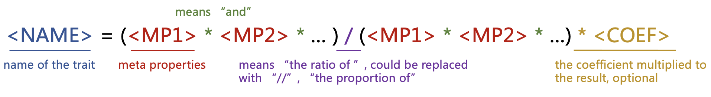

# GlyTrait

## Overview

Glycan derived trait is a more insightful way to analysis glycomics data. However, currently there
lacks a tool for automatically calculating derived traits, while mannual calculating is
cumbersome, time-consuming and error-prone. GlyTrait is a tool designed for calculating N-glycan
traits merely from abundance information and glycan structures.

## Contents

- [Installation](#installation)
    - [Requirement](#requirement)
    - [Using pipx (recommended)](#using-pipx-recommended)
- [Usage](#usage)
    - [Quick start](#quick-start)
    - [Mode](#mode)
    - [Input file format](#input-file-format)
    - [Specify output path](#specify-output-path)
    - [Structure file](#structure-file)
    - [Built-in database](#built-in-database)
    - [Preprocessing](#preprocessing)
    - [Sialic-acid-linkage traits](#sialic-acid-linkage-traits)
    - [Filtering](#filtering)
    - [Hypothesis testing](#hypothesis-testing)
    - [The GlyTrait Formula](#the-glytrait-formula-advanced)
- [License](#license)

## Installation

### Requirement

```
python >= 3.10
```

If python hasn't been install, download it from
its [its website](https://www.bing.com/search?q=python&form=APMCS1&PC=APMC), or
use [Anaconda](https://www.anaconda.com/download/) if you like.

### Using pipx (recommended)

pipx is a tool to help you install and run end-user applications written in Python. It's roughly
similar to macOS's brew, JavaScript's npx, and Linux's apt.

#### Install pipx

Install pipx following its [Document](https://pypa.github.io/pipx/installation/).

#### Install GlyTrait from PyPi

```shell
pipx install glytrait
```

#### Or install GlyTrait locally

1. Clone the repository (or download it manually):

```shell
git clone https://github.com/fubin1999/glytrait.git
```

2. Move to the repository:

```shell
cd glytrait
```

3. Install glyTrait with pipx:

```shell
pipx install .
```

## Usage

### Quick start

```shell
glytrait data.csv
```

That's it! If everything goes well, a xlsx file named "data_glytrait.xlsx" will be saved to the
same directory with data.csv. Inside the xlsx file are four (five) sheets:

1. The summary;
2. The trait values for each sample;
3. The trait descriptions;
4. The meta properties GlyTrait generated to calculated derived traits;
5. The hypergeometric test results for each trait, if group information is provided.

You don't need the forth one for common situations, but a peek of it might help you better
understand how GlyTrait works.

The detailed format of the input file will be introduced in the **Input file format** section.

### Mode

GlyTrait has two modes: the **structure** mode and the **composition** mode. In the structure
mode, GlyTrait will calculate derived traits based on the topology properties of glycan
structures. In the composition mode, GlyTrait will calculate derived traits based on the
compositions.

Note that the composition mode has uncertainties to some extent. Specifically:

1. Estimating the number of Gal based on composition is not possible for hybrid glycans, so
   GlyTrait will calculate the number of Gal assuming there are no hybrid glycans. Luckily, hybrid
   glycans are usually in low abundance, so the algorithm is a good approximation for most cases.
2. Estimating the number of branches is not possible based on composition, so GlyTrait will
   roughly classify glycans into 2 categories: low-branching and high-branching. Glycans with
   N > 4 (including bisecting diantenary glycans) are considered as high-branching, while others
   as low-branching.
3. Telling hybrid glycans from mono-antenary complex glycans is not possible based on composition,
   so GlyTrait will not classify glycans into complex, hybrid and high-mannose.

Due to the ambiguities above, we recommend using the structure mode if possible. If structure
information is not available but your samples are serum or plasma, you can use the built-in
structure database. (See the [Built-in database](#built-in-database) section for more
information.)

The default mode is the structure mode, as in the quick start example. You can specify the mode
by the "-m" or the "--mode" option:

```shell
glytrait data.csv -m composition
```

Or in short:

```shell
glytrait data.csv -m C
```

Using `glytrait -m structure` or `glytrait -m S` is equivalent to `glytrait` alone.

### Input file format

The input csv file should have at least 3 columns:

1. The **first** column with header "Composition" is the condensed composition representation of
   the glycans, e.g. "H5N4F1S2".
2. The **second** column with header "Structure" is the structure string of the glycans. We only
   support condensed GlycoCT now as it can be exported from GlycoWorkbench. A complete structure
   with all linkage specified is not necessary, because GlyTrait actually use the topology
   properties of glycan structures regardless of the linkage information. However, sialic acid
   linkage is needed if you want to calculate the sialic-acid-linkage traits. (See the
   [Sialic-acid-linkage traits](#sialic-acid-linkage-traits) section for more information.)
3. **From the third column on** is the glycan abundance for different samples, with sample names
   as the headers. Normalization is not necessary because GllyTrait will carry out a Total
   Abundance Normalization for all samples before calculating derived traits.

**Note that Compositions and Structures should all be unique!** If glycans with the same
composition but different structures are present, please modify the "Composition" to make them
unique, e.g. "H5N4F1S2_1" and "H5N4F1S2_2", as in the structure mode GlyTrait will use the
"Composition" column perely as glycan identifiers.

An example input file would be like:

| Composition | Structrue | Sample1 | Sample2 | Sample3 |
|-------------|-----------|---------|---------|---------|
| H3N3F1      | RES...    | 0.0417  | 0.0503  | 0.0354  |
| H3N4        | RES...    | 0.0233  | 0.0533  | 0.0593  |
| H3N4F1      | RES...    | 0.0123  | 0.0133  | 0.0194  |

This file contains 3 glycans (H3N3F1, N3N4 and N3N4F1) and three samples (Sample 1, 2, and 3).

The "Structure" column is not necessary in the composition mode, and also not necessary if you
use the built-in structure database (see [Built-in database](#built-in-database) section) or
provide a structure file (see [Structure file](#structure-file) section) in the structure mode. In
these cases, the input file would be like:

| Composition | Sample1 | Sample2 | Sample3 |
|-------------|---------|---------|---------|
| H3N3F1      | 0.0417  | 0.0503  | 0.0354  |
| H3N4        | 0.0233  | 0.0533  | 0.0593  |
| H3N4F1      | 0.0123  | 0.0133  | 0.0194  |

### Specify output path

You might noticed before that GlyTrait save the output file to the same directory as the input
file with a "_glytrait" suffix. You can specify the output file path by using the "-o" or "
--output-file" option:

```shell
glytrait data.csv -o output.xlsx
```

Note that a ".xlsx" suffix is needed.

### Structure file

You could provide glycan structures in a separate "structure file" using the "-s" or the
"--structure-file" option:

```shell
glytrait data.csv -s structure.csv
```

The format of structure.csv is:

| Composition | Structure |
|-------------|-----------|
| H3N3F1      | RES...    |
| ...         | ...       |

If a structure file is provided, the "Structure" column in the input file is not necessary.

If the abundance file has compositions without corresponding structure in the structure
file, an error will be raised. However, the structure file could contain glycans not in the
abundance file, and GlyTrait will just ignore these glycans. This feature is useful if you have
a pre-defined structure database and want to calculate derived traits for many sets of samples.

### Built-in database

N-glycans of some common sample types are well-studied, e.g. serum and plasma. If your samples
are serum or plasma, you can use the built-in structure database by the "-d" or the "--database"
option:

```shell
glytrait data.csv -d serum
```

If a built-in database is used, the "Structure" column in the input file is not necessary.

The supported database
names are:

- serum: for serum or plasma N-glycans.
  ([Song, T. Anal. Chem. 2015](https://pubs.acs.org/doi/10.1021/acs.analchem.5b01340))
- IgG: for N-glycans on serum or plasma IgG.

### Preprocessing

GlyTrait will carry out a preprocessing step before calculating derived traits. The following
steps will be done:

- Remove glycans with missing values in more than a certain proportion of samples.
- Impute missing values.
- Perform Total Abundance Normalization.

In the glycan-filtering step, the proportion threshold could be specified by the "-r" or the
"--filter-glycan-ratio" option. The default value is 0.5, which means if a glycan has missing
values in more than 50% of samples, it will be removed. You can change this value to 0.3 by:

```shell
glytrait data.csv -r 0.3
```

The imputation method could be specified by the "-i" or the "--impute-method" option. The default
method is "min", which means missing values will be imputed by the minimum value of a glycan.
Other supported methods are "mean", "median", "zero", "lod". You can change imputation method to
"mean" by:

```shell
glytrait data.csv -i mean
```

A full list of supported imputation methods are:

- "min": impute missing values by the minimum value of a glycan within all samples.
- "mean": impute missing values by the mean value of a glycan within all samples.
- "median": impute missing values by the median value of a glycan within all samples.
- "zero": impute missing values by 0.
- "lod": impute missing values by the limit of detection (LOD) of the equipment. The LOD of a
  glycan is defined as the minimum value of the glycan within all samples divided by 5.

### Sialic-acid-linkage traits

Sialic acids can have different linkages for N-glycans (e.g. α2,3 and α2,6). Different sialic acid
linkage has different biological functions. GlyTrait supports calculating derived traits
regarding these linkages. To use this feature, you need to have siaic acid linkage information.

In the structure mode, the "Structure" column or the structure file should contain the linkage
information. Only linkage information about sialic acids is needed. This can be easily done using
GlycoWorkbench.

In the composition mode, the "Composition" column must contain the linkage information. GlyTrait
uses a common notation for sialic acid with different linkages: "E" for a2,6-linked sialic acids,
and "L" a2,3-linked sialic acids. For example, "H5N4F1E1L1" contains 2 sialic acids, one is
a2,6-linked and the other is a2,3-linked.

You can use the "-l" or "--sia-linkage" option to include sialic-acid-linkage traits:

```shell
glytrait data.csv -l
```

Note that if you use this option, all glycans with sialic acids should have linkage information.
That is to say all structure strings should have structure information in the structure mode and
no "S" in composition strings in the composition mode.

### Post-Filtering

Some derived traits might not be useful for your analysis. For example, some traits might all have
the same value for all samples, or be NaN due to zero being in the denominator. GlyTrait rules out
these traits by default. If you want to keep these traits, use the "--no-filter" option:

```shell
glytrait data.csv --no-filter
```

### Hypothesis testing

GlyTrait supports hypothesis testing for direct and derived traits. To use this feature, you need
to provide a csv file containing the sample grouping information. The csv file should have two
columns, the first column is the sample name, and the second column is the group name. An example
group file would be like:

| Sample  | Group  |
|---------|--------|
| Sample1 | Group1 |
| Sample2 | Group1 |
| Sample3 | Group2 |
| Sample4 | Group2 |

Then use the "-g" or "--group-file" option to specify the group file:

```shell
glytrait data.csv -g group.csv
```

GlyTrait will carry out Mann-Whitney U Test for two groups, and Kruskal-Wallis H Test for more
than two groups. The Benjamini-Hochberg procedure is used to correct the p-values. For
more-than-two-groups situations, the Mann-Whitney U Test will be used for post-hoc test. GlyTraits
uses non-parametric tests for the sake of robustness.

A post-filtering step will be carried out before hypothesis testing, even if the "--no-filter"
option is used. (See [Post-Filtering](#post-filtering) for details.)

### The GlyTrait Formula (Advanced)

Currently 277 derived traits (including sialic acid linkage traits) is included in the GlyTrait
tool. This list is curated from literature and covers nearly all derived traits reported. However,
you may want to add new traits to fulfill your own need. GlyTriat using a meta-properties-oriented
formula system, the **GlyTrait Formula**, to represent the meaning of a trait. **GlyTrait Formula
** is a versatile tool allowing you to add your own traits.

#### GlyTrait Formula overview

**GlyTrait Formula** is a text based formula representing sys allowing you to combine various meta
properties to get new traits. As an overview, the formula should be in the format of:



- <Name> is the name of the formula, which will be used as the column name in the output file.
- <Numerator1>, <Numerator2>, ... are the meta properties of the numerator.
- <Denominator1>, <Denominator2>, ... are the meta properties of the denominator.
- () is necessary to group the numerator and denominator for clearness, even if there is only one
  meta property on the numerator and the denominator.
- All numerators and denominators should be separated by "*". If there is only one numerator or
  denominator, "*" is not needed.
- The "/" is necessary to separate the numerator and denominator. If the trait is a proportion of
  something within something, use "//" instead of "/".
- Some formulas may use all glycans as the denominator. In this case, use (.) as the denominator.
  A combination of "." and other meta properties (e.g. (. * isComplex)) is not
  allowed.
- <Coefficient> is the coefficient multiplied to the final result. The coefficient part (* <Coefficient>) is optional. If omitted, the coefficient is assumed to be 1.

For more details and step-by-step instructions on how to write a formula, refer to the template
file generated by `glytrait -t some_dir` (see setion below).

#### Get the formula template file

To start using **GlyTrait Formula**, you first need to get a formula template file by using the "
-t" or "--save_template" option:

```shell
glytrait -t some_dir
```

An template txt file will be saved in the given "some_dir" directory. "some_dir" needed to exist,
GlyTrait will create this folder for you if it doesn't exist. A detailed instruction on how to
write trait formulas is in that file.

#### Using the custom formulas

Once you have editing the template file with new formulas in, you can try them out. For
incoperating the custom formulas, use the "-f" or "--formula-file" option:

```shell
glytrait data.csv -f custom_formulas.txt
```

That will do, GlyTrait will calculate the default traits, plus your cumtom traits.
A few things to be noted:

- If a custom formula has the same name with a default formula, it will be ignored.
- If more than one custom formulas have the same name, only the first one will be used.
- If any formula is in wrong format, GlyTrait will raise an error to inform you.

## License

[MIT License](LICENSE)
